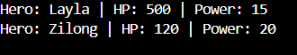
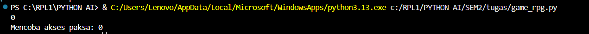

# Sistem Pertarungan Game (Battle System) Sederhana Menggunakan Konsep Polymorphism pada Python

### Nama: Aveline Voleta Wardani
### Kelas: XI RPL 1
### Mata Pelajaran: Koding dan Kecerdasan Artifisial (KKA)
### Bahasa Pemrograman: Python

## 🧙‍♂️ Python RPG OOP Game

Project sederhana game RPG berbasis **Object Oriented Programming (OOP)** menggunakan Python.

Project ini dibuat untuk latihan konsep:
- Class & Object
- Inheritance
- Constructor (`__init__`)
- Method
- Super()

---

## 🎮 Fitur Game
Saat ini game memiliki:

- Class dasar `Hero`
- Subclass:
  - `Warrior`
  - `Mage`
- Menampilkan info hero (HP & Attack Power)

## ANALISIS 1
Apa yang terjadi jika kamu mengubah hero1.hp menjadi 500 setelah baris
hero1 = Hero...? Coba lakukan print(hero1.hp).

JAWAB:
HP Layla langsung berubah jadi 500.

Contoh output:
## 📸 Screenshot Program

## ANALISIS 2
Perhatikan parameter lawan pada method serang. Parameter tersebut
menerima sebuah objek utuh, bukan hanya string nama. Mengapa ini
penting?

JAWAB:
Ini penting karena proses menyerang butuh mengubah kondisi lawan, bukan sekadar menyebut namanya.
### 📸 Output Program

## ANALISIS 3
### 📸 Output Program

- Eksperimen Fungsi super(): Pada class Mage, coba hapus (atau jadikan
komentar #) baris kode super().__init__(name, hp, attack_power). Kemudian
 jalankan programnya

 JAWAB:
akan muncul error, karena Saat super() dihapus, constructor Hero tidak pernah dijalankan.
Akibatnya object Mage tidak mewarisi atribut Hero.

### 📸 Output Program

- Pertanyaan: Error apa yang muncul saat kamu mencoba melihat info Eudora
(eudora.info())? Mengapa error tersebut mengatakan Mage object has no
attribute 'name', padahal kita sudah mengirim nama "Eudora" saat
pembuatan objek?

JAWAB:
Error terjadi karena constructor class induk (Hero) tidak dijalankan, sehingga atribut name, hp, dan attack_power tidak pernah dibuat pada objek Mage walaupun nilai tersebut sudah dikirim saat pembuatan objek.

- Jelaskan peran fungsi super() dalam menghubungkan data dari class Anak ke
class Induk!

JAWAB: 
Karena fungsi super() berperan sebagai “jembatan” antara class Anak (child) dan class Induk (parent) agar data dan perilaku dari class induk bisa digunakan oleh class anak.

## ANALISIS 4
#### - Pertanyaan:
1. Percobaan Hacking: Coba tambahkan baris kode berikut di bagian paling
bawah (luar class):
print(f"Mencoba akses paksa: {hero1._Hero__hp}")

Pertanyaan: Apakah nilai HP muncul atau Error? Jika muncul, diskusikan dengan
temanmy mengapa Python masih mengizinkan akses ini (konsep Name Mangling)
dan mengapa kita tetap tidak boleh melakukannya dalam standar pemrograman
yang baik.

JAWAB:
Meskipun atribut __hp bersifat private, Python masih mengizinkan akses menggunakan format khusus _Hero__hp. Hal ini terjadi karena Python menggunakan mekanisme yang disebut Name Mangling, yaitu mengubah nama atribut private secara internal untuk mencegah akses langsung yang tidak disengaja.
Namun, cara ini tidak dianjurkan dalam standar pemrograman yang baik karena melanggar prinsip enkapsulasi. Atribut private seharusnya hanya diakses melalui getter dan setter untuk menjaga keamanan dan konsistensi data.
### 📸 Output Program

2. Uji Validasi: Hapus logika if dan elif di dalam method set_hp, sehingga isinya
hanya self.__hp = nilai_baru.

Pertanyaan: Kemudian lakukan hero1.set_hp(-100).
Apa yang terjadi pada data HP Hero? Jelaskan mengapa keberadaan method
Setter sangat penting untuk menjaga integritas data dalam game!

JAWAB:
HP menjadi bernilai negatif karena tidak ada validasi pada setter. Tanpa validasi, program akan menerima nilai apapun, termasuk nilai yang tidak logis seperti HP negatif.
Dalam konteks game, HP negatif dapat menyebabkan kesalahan logika dan merusak sistem permainan.

Method setter sangat penting karena berfungsi untuk:
- Memvalidasi nilai sebelum disimpan
- Mencegah data tidak valid seperti HP negatif
- Melindungi atribut private dari perubahan langsung
- Menjaga konsistensi dan stabilitas sistem
Dengan adanya setter yang memiliki validasi, data yang disimpan akan tetap sesuai dengan aturan yang telah ditentukan.

### 📸 Output Program

## ANALISIS 5
### 📸 Output Program

#### - Pertanyaan: 

1. Melanggar Kontrak: Pada class Hero, hapus (atau jadikan komentar #) seluruh
blok method def serang(self, target):. Jalankan programnya.

Pertanyaan: Error apa yang muncul? Jelaskan dengan bahasamu sendiri, apa arti
pesan error Can't instantiate abstract class Hero with abstract
method...? 
Apa konsekuensinya jika kita lupa membuat method yang sudah dijanjikan di
Interface?

JAWAB:
Error tersebut terjadi karena class Hero tidak mengimplementasikan method abstract serang() yang diwariskan dari class GameUnit. Abstract method merupakan kontrak yang wajib diimplementasikan oleh setiap class turunan. Jika tidak diimplementasikan, maka class tersebut dianggap belum lengkap dan tidak dapat dibuat menjadi object.
### 📸 Output Program

2. Mencetak Cetakan: Coba aktifkan baris kode unit = GameUnit().
Pertanyaan: Mengapa class GameUnit dilarang untuk dibuat menjadi objek?
Apa gunanya ada class GameUnit jika tidak bisa dibuat menjadi objek nyata?

JAWAB:
Abstract class tidak dapat dibuat menjadi object karena berfungsi sebagai cetakan dasar saja. Abstract class hanya digunakan sebagai kerangka untuk class turunannya.

Fungsi Abstract Class

- Abstract class memiliki beberapa fungsi, yaitu:
- Sebagai cetakan dasar bagi class turunan
- Menentukan method yang wajib dimiliki class turunan
- Menjaga konsistensi struktur program
- Mendukung konsep polymorphism
- Mempermudah pengembangan program
### 📸 Output Program

## ANALISIS 6
Tujuan: Menjalankan perintah yang sama (serang) ke berbagai jenis objek berbeda,
dan hasilnya menyesuaikan masing-masing objek.

#### - Pertanyaan:
1. Uji Skalabilitas (Kemudahan Menambah Fitur): Tanpa mengubah satu huruf
pun pada kode Looping (for pahlawan in pasukan:), buatlah satu class
baru bernama Healer(Hero).
Isi method serang milik Healer dengan: print(f"{self.name} tidak
menyerang, tapi menyembuhkan teman!").
Masukkan objek Healer ke dalam list pasukan.

o Pertanyaan: Apakah program berjalan lancar?
o Kesimpulannya, apa keuntungan Polimorfisme bagi seorang programmer
ketika harus mengupdate game dengan karakter baru di masa depan?

JAWAB:

o Analisis 
Hal ini membuktikan bahwa:
- Kita bisa menambahkan karakter baru
- Tidak perlu mengubah sistem utama (looping)
- Program tetap stabil

o Kesimpulan Uji 1
- Polymorphism membuat program:
- Mudah dikembangkan
- Fleksibel
- Skalabel untuk update karakter baru

### 📸 Output Program

2. Konsistensi Penamaan: Ubah nama method serang pada class Archer
menjadi tembak_panah. Jalankan program.

Pertanyaan: Apa yang terjadi?
Mengapa dalam konsep Polimorfisme, nama method antara Parent Class dan
berbagai Child Class harus persis sama?

JAWAB:
Karena method serang() tidak ditemukan pada class Archer, maka Python menggunakan method milik Parent Class.
Akibatnya:
- Polymorphism tidak berjalan dengan benar
- Perilaku khusus Archer tidak dipanggil

### 📸 Output Program

## - TERIMAKASIH - 

